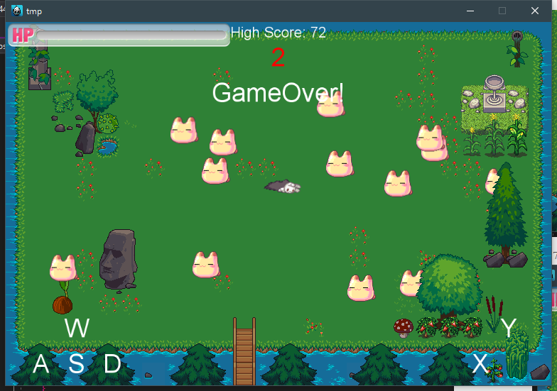

# Cocos2d-x 2D横板游戏

这一周我们来做一个真正可以攻击的2D横板游戏。


## 瓦片地图

首先，我们需要设计出一张地图，这里我们使用Tiled地图编辑器来编辑地图。

新建一个地图，设置他的大小为24x16，每个方块的大小为32x32，得出总的分辨率为768, 512。

从网上找来一些素材，然后导入到图块中，接下来就可以随心所欲地设计地图了。


最后把地图保存为一个`tmx`文件

需要注意的是，通过文本阅读软件打开`tmx`文件后可以看出一些素材源文件只是以相对路径的方式存储在里面，因此我们需要保证素材源文件和这个地图文件的相对目录结构不被破坏，否则需要修改里面的信息使得程序可以加载到那些素材源文件(如果`tmx`引用了`tsx`, 那么`tsx`里面一般会包含`png`的路径)。这些所有的文件都需要添加到`Resources`里面。

设计好一个不同层次的地图


这样可以使得我们的精灵处于某些层次之上某些层次之下，使得地图更加有立体感。


然后就是把地图添加到场景中去。

修改AppDelegate.cpp中的设置，使得地图与视图大小一样。

```cpp
static cocos2d::Size designResolutionSize = cocos2d::Size(768, 512);
```

然后在场景加载的时候将地图加入到场景的最底层

```cpp
// 根据文件路径快速导入瓦片地图
tmx = TMXTiledMap::create("coco.tmx");
// 设置位置
tmx->setPosition(visibleSize.width / 2, visibleSize.height / 2);
// 设置锚点
tmx->setAnchorPoint(Vec2(0.5, 0.5));
// 设置缩放
tmx->setScale(Director::getInstance()->getContentScaleFactor());
addChild(tmx, 0);
```

这样就可以完成地图的加载了，此外，还可以通过

```cpp
objs = tmx->getObjectGroup("wall");
```

将瓦片地图中的对象信息提取出来。

为了使得我们添加的精灵位于地图的某个层内， 我们需要把精灵添加到地图里面的层，而不是直接添加到场景的层。

```cpp
// 地图内的第三层
tmx->addChild(player, 1);
```

这里需要关注的是，地图中的层次顺序并不是合符直觉的，比如说我想把人物添加到地图中第三层中，需要设置他的`ZOrder`为`1`， 大概是他是从`-1`开始计算的吧。

当我们把人物添加到地图的子元素后， 人物的坐标就是地图的本地坐标而不是世界坐标，这一点我们需要关注。


## 随机生成怪物

为了统一管理生成的怪物，这里新建了一个工厂类。

需要注意的是：如果你是从vs里面的解决方案管理器直接创建的，那么文件的默认位置就是在`proj.win32`下面而不是`Classes`里面，这样当我们引用的时候就会出现找不到的情况。

```cpp
class Factory :public cocos2d::Ref {
public:
	//获取单例工厂
	static Factory* getInstance();
	//生成一个怪物，并存储到容器中管理
	Sprite* createMonster();
	//让容器中的所有怪物都往角色移动，通过容器管理所有的怪物很方便
	void moveMonster(Vec2 playerPos, float time);
	//移除怪物
	void removeMonster(Sprite*);
	//判断碰撞
	Sprite* collider(Rect rect);
	//初始化怪物帧动画
	void initSpriteFrame();
	//获取怪物数量
	int getCount();
private:
	Factory();
	Vector<Sprite*> monster;
	cocos2d::Vector<SpriteFrame*> monsterDead;
	static Factory* factory;
};
```


然后在场景里面新建一个调度器，每2秒生成一次怪物并且将其向人物方向移动。

```cpp
// 添加怪物
this->schedule(schedule_selector(HelloWorld::addMonster), 2.0f);
```

```cpp
void HelloWorld::addMonster(float dt) {
	auto fac = Factory::getInstance();
	// 允许场上最多的怪物数量
	if (fac->getCount > 20) return;
	for (int i = 0; i < 3; i++) {
		auto m = fac->createMonster();
		auto loc = Vec2(random(origin.x, visibleSize.width), 
						random(origin.x, visibleSize.height));
		m->setPosition(tmx->convertToNodeSpace(loc));
		tmx->addChild(m, 1);
	}
	fac->moveMonster(player->getPosition(), 0.5f);
}
```


## 人物翻转

这个比较简单，只需要设置一个变量来存储之前人物的移动方向，然后判断此刻的移动方向是否和之前的方向相等，如果不相等就需要使得人物翻转

```cpp
// 反转人物
if (dir == 1 && ldir != 1) {
    player->setFlipX(true);
    ldir = dir;
}
else if (dir == 3 && ldir != 3) {
    player->setFlipX(false);
    ldir = dir;
}
```


## 碰撞与攻击判断

对于怪物和人物的碰撞判断比较简单，只需要通过`player->getBoundingBox()`然后交给工厂类判断在这个矩形里面是否存在怪物。

但是对于攻击判断就需要额外判断一下方向，根据上面设置的`ldir`变量，我们可以获得人物面对的方向，然后根据这个方向对人物的边框矩形进行扩展

```cpp
// 根据方向确定攻击范围
Rect playerRect = player->getBoundingBox();
Rect attackRect;
if (ldir == 1) {
    attackRect = Rect(playerRect.getMinX() - 60, playerRect.getMinY(),
                      playerRect.getMaxX() - playerRect.getMinX() + 70,
                      playerRect.getMaxY() - playerRect.getMinY());
}
else {
    attackRect = Rect(playerRect.getMinX() - 10, playerRect.getMinY(),
                      playerRect.getMaxX() - playerRect.getMinX() + 70,
                      playerRect.getMaxY() - playerRect.getMinY());
}
```

然后消灭掉指定矩形中的怪物并且增加击杀数。

我们之前从地图中加载出了`Wall`对象，因此我们可以在人物移动的时候加上对墙的检测。

```cpp
// 判断坐标是否在墙内
bool HelloWorld::isToWall(Vec2 loc) {
	// 从对象层中获取对象数组
	ValueVector container = objs->getObjects();
	// 遍历对象
	for (auto obj : container) {
		ValueMap values = obj.asValueMap();
		// 获取纵横轴坐标（cocos2dx坐标）  
		int x = values.at("x").asInt() - 10;
		int y = values.at("y").asInt() - 10;
		int w = values.at("width").asInt() + 20;
		int h = values.at("height").asInt() + 20;
		auto wloc = tmx->convertToNodeSpace(loc);
		if ((wloc.x > x && wloc.x < x + w) &&
			(wloc.y > y && wloc.y < y + h)) {
			return true;
		}
	}
	return false;
}
```


## 保存与恢复

在这个游戏里面，我们需要保存最高得分并且在下次加载的时候读取出来。

使用方法也是十分地简单

```cpp
UserDefault::getInstance()->getIntegerForKey("killCount");
UserDefault::getInstance()->getIntegerForKey("killCount", 100);
```


当然，这里我使用了另一种方法，就是SQLite数据库

首先把头文件引进来

```cpp
#include "sqlite3.h"
```

然后在场景初始化的时候读取数据，把最高分读取进来.

首先时打开数据库，然后查询对应表有没有数据，如果有数据就读取出来。

```cpp
// 最高得分
char dHighStr[30];
//数据库指针
sqlite3* pdb = nullptr;
//数据库路径
std::string path = FileUtils::getInstance()->getWritablePath() + "save.db";
//根据路径path打开或创建数据库
int result = sqlite3_open(path.c_str(), &pdb);
//若成功result等于SQLITE_OK
if (result == SQLITE_OK) {
    char **re;//查询结果
    int row, col;//行、列
    sqlite3_get_table(pdb, "select * from score;", &re, &row, &col, NULL);
    if (row == 0) {
        std::string sql = "create table score(ID int primary key not null, number int);";
        sqlite3_exec(pdb, sql.c_str(), nullptr, nullptr, nullptr);
        highScore = 0;
    }
    else {
        highScore = atoi(re[3]);
    }
} else {
    highScore = 0;
}
// highScore = database->getIntegerForKey("killCount");
sprintf(dHighStr, "High Score: %d", highScore);
LabelHigh = Label::createWithTTF(dHighStr, "fonts/arial.ttf", 20);
LabelHigh->setColor(Color3B(255, 255, 255));
LabelHigh->setPosition(Vec2(visibleSize.width / 2, visibleSize.height - 15));
this->addChild(LabelHigh, 1);
```

在游戏结束的时候，如果单局得分比最高得分高，那么就将得分存储到数据库中

```cpp
//数据库指针
sqlite3* pdb = nullptr;
//数据库路径
std::string path = FileUtils::getInstance()->getWritablePath() + "save.db";
//根据路径path打开或创建数据库
int result = sqlite3_open(path.c_str(), &pdb);
//若成功result等于SQLITE_OK
if (result == SQLITE_OK) {
    char sql[50] = "delete from score where id=1;";
    int rc = sqlite3_exec( pdb, sql, nullptr, nullptr, nullptr);
    sprintf(sql, "insert into score values(1,'%d');", killCount);
    rc = sqlite3_exec(pdb, sql, nullptr, nullptr, nullptr);
}
```

这里主要是使用SQL语句，而且没有涉及到回调操作，因此还是比较简单的。

## 游戏截图




