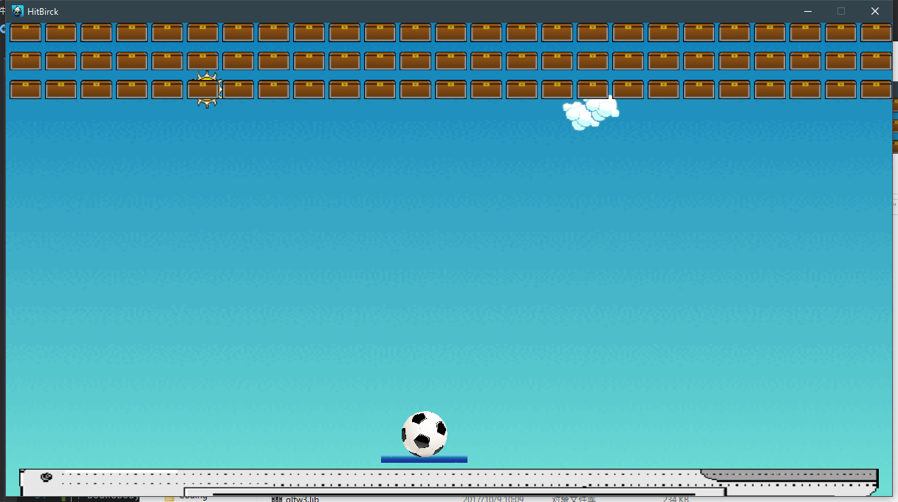
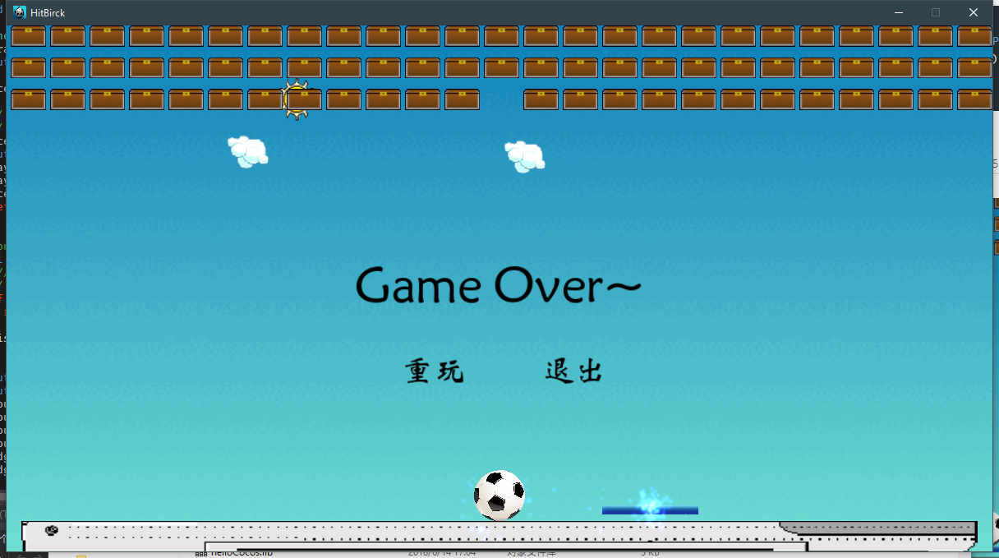
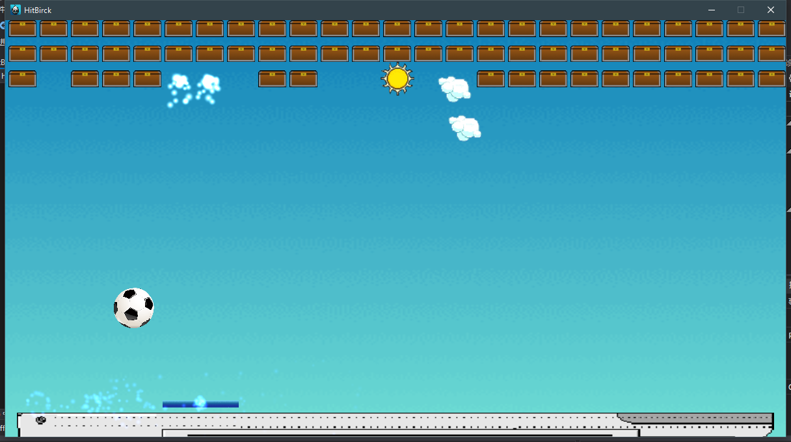

# 打砖块

这一周的任务是做一个打砖块的小游戏，主要用到的是物理系统


## 物理世界

在使用Cocos2dx的物理引擎之前，必须把场景设置为物理世界，并赋予一定的物理属性。

```cpp
Scene* HitBrick::createScene() {
  srand((unsigned)time(NULL));
  auto scene = Scene::createWithPhysics();

  scene->getPhysicsWorld()->setAutoStep(true);

  // Debug 模式
  // scene->getPhysicsWorld()->setDebugDrawMask(PhysicsWorld::DEBUGDRAW_ALL);
  scene->getPhysicsWorld()->setGravity(Vec2(0, -300.0f));
  auto layer = HitBrick::create();
  layer->setPhysicsWorld(scene->getPhysicsWorld());
  layer->setJoint();
  scene->addChild(layer);
  return scene;
}
```


## 控制板子左右移动

在物理世界中，我们可以通过基于一个物体初速度来控制他的移动。

因此简单的实现可以在键盘事件中直接赋予初速度

```cpp
// 键盘按下监听器
case cocos2d::EventKeyboard::KeyCode::KEY_LEFT_ARROW:
case cocos2d::EventKeyboard::KeyCode::KEY_A:
    player->getPhysicsBody()->setVelocity(Vec2(-700, 0));
    break;
// 键盘释放监听器
case cocos2d::EventKeyboard::KeyCode::KEY_LEFT_ARROW:
    player->getPhysicsBody()->setVelocity(Vec2(0, 0));
    break;
```

但是实际上这种方法还有着比较多的不足之处。

首先，如果你首先按下了右然后再按下左，释放右，按照上面的写法，物体事实上会停止运动，但是实际上左还是处于按下的状态的。因此在释放的时候需要判断一下当前物体的运动方向，如果和释放的一致才停止下来。

然后，由于我设置了`player`为静态的，因此不受边界的阻挡，因此可以移动到边界之外，因此需要判断一下碰撞以及是否超出边界来响应他的事件。

```cpp
// 键盘按下
void HitBrick::onKeyPressed(EventKeyboard::KeyCode code, Event* event) {
    ...
    case cocos2d::EventKeyboard::KeyCode::KEY_LEFT_ARROW:
    case cocos2d::EventKeyboard::KeyCode::KEY_A:
        if (player->getBoundingBox().getMinX() <= 0) return;
        player->getPhysicsBody()->setVelocity(Vec2(-700, 0));
        isLeft = true;
    break;
    case cocos2d::EventKeyboard::KeyCode::KEY_RIGHT_ARROW:
    case cocos2d::EventKeyboard::KeyCode::KEY_D:
        if (player->getBoundingBox().getMaxX() >= visibleSize.width) return;
        player->getPhysicsBody()->setVelocity(Vec2(700, 0));
        isLeft = false;
    break;
    ...
}
// 键盘释放
void HitBrick::onKeyReleased(EventKeyboard::KeyCode code, Event* event) {
    ...
    case cocos2d::EventKeyboard::KeyCode::KEY_LEFT_ARROW:
        if (isLeft) player->getPhysicsBody()->setVelocity(Vec2::ZERO);
        break;
    case cocos2d::EventKeyboard::KeyCode::KEY_RIGHT_ARROW:
        if (!isLeft) player->getPhysicsBody()->setVelocity(Vec2::ZERO);
        break;
    ...
}
// 碰撞检测
bool HitBrick::onConcactBegin(PhysicsContact & contact) {
    ...
    if (tag1 == TAG_BOUNDBODY && tag2 == TAG_PLAYER) {
        c2->getBody()->setVelocity(Vec2::ZERO);
    }
    if (tag2 == TAG_BOUNDBODY && tag1 == TAG_PLAYER) {
        c1->getBody()->setVelocity(Vec2::ZERO);
    }
    ...
}
```


## 在顶部生成小砖块

我们要生成三层砖块，因此外部循环为3

然后内部循环用while，直到整行被填满。

为砖块设置刚体属性`PhysicsMaterial(300.0f, 1.0f, 0.0f)`，并且设置好碰撞掩码，使得砖块与球会发生碰撞。

最后计算出每个状态的位置。

```cpp
for (int i = 0; i < 3; i++) {
	int cw = 0;
	while (cw <= visibleSize.width) {
		auto box = Sprite::create("box.png");
		// 为砖块设置刚体属性
		// Todo - Done
		auto physicsBody = PhysicsBody::createBox(box->getContentSize(), PhysicsMaterial(300.0f, 1.0f, 0.0f));
		physicsBody->setDynamic(false);
		physicsBody->setCategoryBitmask(0x0000000F);
		physicsBody->setCollisionBitmask(0x0000000F);
		physicsBody->setContactTestBitmask(0x0000000F);
		physicsBody->setTag(TAG_BLICK);
		box->setPhysicsBody(physicsBody);
		box->setAnchorPoint(Vec2(0.0f, 1.0f));
		cw += 5;
		box->setPosition(Vec2(cw, visibleSize.height - i * box->getContentSize().height * 1.5));
		cw += box->getContentSize().width;
		if (cw > visibleSize.width) break;
		addChild(box);
	}
 }
```


## 使用关节固定球与板子

Cocos2dx里面有很多中关节固定方法，这里选择了`PhysicsJointPin`。

`PhysicsJointPin`有两种构造方式，一种是用1个点固定，另一种是用2个点固定。为了实现球固定在板上并且一开始有一个下降的效果，这里使用了2个点固定的方法。

为了使得球不会乱动，`player`的固定点需要设置到球的球心，这里需要通过`ball`的坐标计算出来。而`ball`的固定点需要在球心，因此为零即可。

需要注意的是，这种构造方式的点是与物理对象中心点的偏移位置。（官方文档说的是锚点，不知道怎么理解的）

```cpp
void HitBrick::setJoint() {
	joint1 = PhysicsJointPin::construct(player->getPhysicsBody(), ball->getPhysicsBody(), Vec2(0, (ball->getBoundingBox().getMaxY() - ball->getBoundingBox().getMinY()) / 2), Vec2::ZERO);
	m_world->addJoint(joint1);
}
```

固定效果




## 蓄力发射小球

蓄力的原理是通过判断按下键到释放键的时间来决定不同的速度，按住越长，速度也会越快。

首先在`update`事件中：

```cpp
void HitBrick::update(float dt) {
	if (spHolded && spFactor < SPEED_BALL_MAX) {
		spFactor += 15;
	}
}
```

这里的`spHolded`在空格按下的时候会被设置为`true`，在释放的时候会被设置为`false`

键盘按下事件：

```cpp
void HitBrick::onKeyPressed(EventKeyboard::KeyCode code, Event* event) {

  switch (code) {
  ...
  case cocos2d::EventKeyboard::KeyCode::KEY_SPACE: // 开始蓄力
	  if (onBall) spHolded = true;
      break;
  ...
  }
}
```

键盘释放事件：

```cpp
void HitBrick::onKeyReleased(EventKeyboard::KeyCode code, Event* event) {
  switch (code) {
  ...
  case cocos2d::EventKeyboard::KeyCode::KEY_SPACE:   // 蓄力结束，小球发射
	  if (onBall) {
		  onBall = false;
		  spHolded = false;
		  m_world->removeJoint(joint1);
		  if (spFactor < SPEED_BALL_MIN) spFactor = SPEED_BALL_MIN;
		  ball->getPhysicsBody()->setVelocity(Vec2(0, spFactor));
		  ball->getPhysicsBody()->setVelocityLimit(spFactor);
		  ball->getPhysicsBody()->setGravityEnable(false);
		  spFactor = 0;
	  }
      break;
      ...
  }
}
```

这里比较需要注意的是，如果你不想使得球在与板在一个特殊角度和速度碰撞后会极大加快球的速度的话，就需要设置一个Limit来限制住球的速度。

` ball->getPhysicsBody()->setVelocityLimit(spFactor);`

这时，还需要将球设置为不受重力影响，否则随着球的重力势能的变大，球就会失去动能了。


## 设置物理属性 

物理属性是物理世界里面各种碰撞事件的关键

设置板的物理属性：

```cpp
// 设置板的物理属性
player->setScale(0.1f, 0.1f);
player->setPosition(Vec2(xpos, ship->getContentSize().height - player->getContentSize().height*0.1f));
// 设置板的刚体属性
auto playerBody = PhysicsBody::createBox(player->getContentSize(), PhysicsMaterial(800.0f, 1.0f, 0.0f));
playerBody->setCategoryBitmask(0xF000000F);
playerBody->setContactTestBitmask(0xF0000000);
playerBody->setDynamic(false);
playerBody->setTag(TAG_PLAYER);
player->setPhysicsBody(playerBody);
```

由于板和球是绑定在一起的，因此如果板不是静态的话，就会受球的影响而倾斜或者便宜。

`PhysicsMaterial(800.0f, 1.0f, 0.0f)`

这里第一个参数为物理的密度，第二个参数为弹性碰撞系数（1为完全弹性碰撞），第三个参数为摩擦系数。

球的物理属性的设置和板也是差不多的，这里就不详细说明了。


## 碰撞检测

Cocos2dx里面的碰撞检测事件是由物理刚体的`CategoryBitmask`和`ContactTestBitmask`这两个掩码决定的，只有当两个物理互相的类型和测试掩码相与都不为0才会触发碰撞检测事件。

这里的碰撞检测事件主要需要做三件事：

- 球碰到地板时候结束游戏
- 球碰到砖块时候，砖块消失
- 板碰到边界的时候，速度为0，防止越出边界

```cpp
bool HitBrick::onConcactBegin(PhysicsContact & contact) {
  auto c1 = contact.getShapeA(), c2 = contact.getShapeB();
  auto tag1 = c1->getBody()->getTag(), tag2 = c2->getBody()->getTag();
  if (tag1 == TAG_SHIPBODY || tag2 == TAG_SHIPBODY) {
	  GameOver();
	  return false;
  }
  if (tag1 == TAG_BLICK && tag2 == TAG_BALL) {
	  addParticle(c1->getBody()->getPosition());
	  c1->getBody()->getNode()->removeFromParentAndCleanup(true);
  }
  if (tag2 == TAG_BLICK && tag1 == TAG_BALL) {
	  addParticle(c2->getBody()->getPosition());
	  c2->getBody()->getNode()->removeFromParentAndCleanup(true);
  }
  if (tag1 == TAG_BOUNDBODY && tag2 == TAG_PLAYER) {
	  c2->getBody()->setVelocity(Vec2::ZERO);
  }
  if (tag2 == TAG_BOUNDBODY && tag1 == TAG_PLAYER) {
	  c1->getBody()->setVelocity(Vec2::ZERO);
  }
  return true;
}
```

游戏结束




## 粒子效果

Cocos2dx里面内置了很多种粒子效果，[文档](http://www.cocos.com/docs/native/v3/particle-system/zh.html)

同时这些粒子效果也有很多属性可以被我们自定义，创造出不同的效果

我这里以`ParticleFlower`为例，创造了一个受重力效果的的散射效果。

同时，在一定时间之后，要从场景中去掉这个效果，这个使用`DelayTime`和`RemoveSelf`动作就很轻易做到。

```cpp
void HitBrick::addParticle(Vec2 pos) {
	auto p = ParticleFlower::create();
	p->setPosition(pos);
	p->setGravity(Vec2(0, -300));
	p->setScale(0.5f);
	p->setLife(1.0f);
	p->setColor(Color3B(120, 71, 18));
	p->setStartColor(Color4F(124, 71, 18, 200));
	p->setEndColor(Color4F(124, 71, 18, 200));
	addChild(p);
	p->runAction(Sequence::create(DelayTime::create(2.0f), RemoveSelf::create(true), nullptr));
}
```

效果图：




## 总结

总的来说，通过Cocos2dx的物理引擎，我们可以


