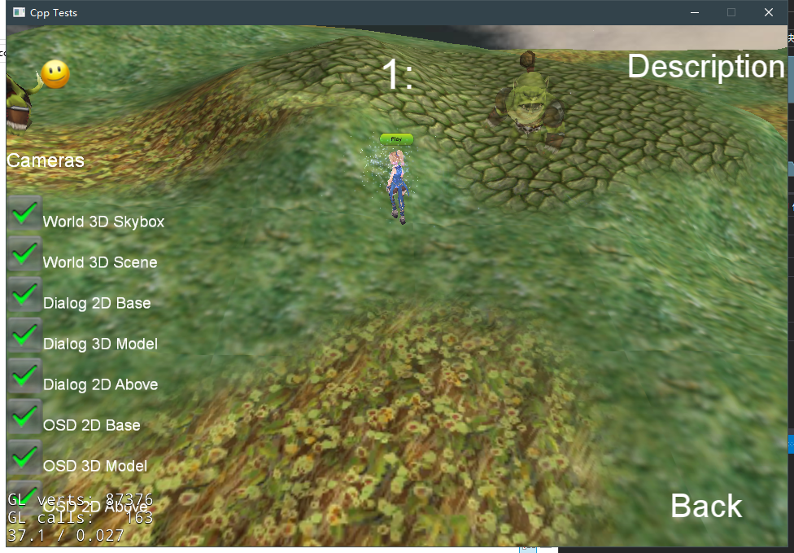
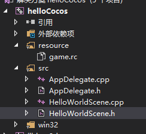
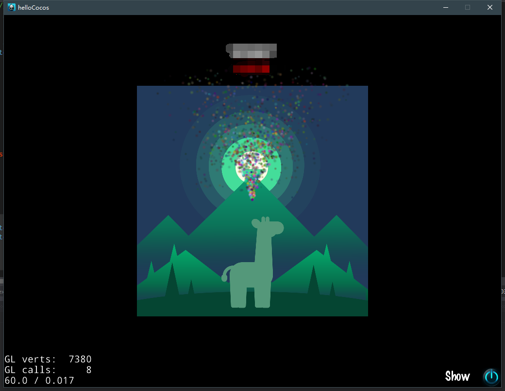

# Cocos2d-x

## 安装

Cocos2d-x 依赖于python2，虽然可以同时存在python3和python2，可以通过`py -2`调用python2，然而`cocos`这个脚本调用的是`python`命令，默认调用python3，为了方便起见，就先把原来的python3删掉，装上python2.

下载并解压`cocos2d-x-3.16`然后运行里面的`setup.py`

```powershell
python ./setup.py
```

如果不需要配置Android环境，那么里面就是配置路径项就可以回车忽略掉

然后使得环境变量生效，就可以使用`cocos`命令了。

## 运行cpp-tests项目

cocos2d-x目录下有一个`cpp-tests`, 里面有各种的示例代码，可以通过Vs打开它，并且改变一下各个解决方案的目标SDK，然后就可以编译运行了。



## 新建项目

```sh
 cocos new helloCocos -p cn.zhenly.hellococos -l cpp
```

- new : 项目名称
- -p：包名
- -l：开发语言
- -d：项目存放目录（默认当前目录\项目名称）

## 打开项目

这里使用的IDE是VS2017

使用VS2017，打开新建项目目录下`proj.win32` 里面的`helloCocos.sln`

如果直接编译是会报错的。

打开之后，需要改变一下这里面的目标平台SDK，因为里面的SDK默认是8.1的，我们要将他替换成我们环境中存在的。单击解决方案资源管理器，右键选择项目属性更改，5个解决方案都需要改一下。

然后就可以编译运行了。

(第一次编译时间很久，可能是渣CPU，而且编译完之后项目大小居然4.57 GB，比一个系统镜像还要大)

## 添加元素



里面`AppDelegate.cpp`是程序的主入口，管理各种生命周期的

`HelloWorldScene.cpp`就是我们第一个场景，我们在里面添加一点元素

打开之后可以看到里面已经存在一些示例代码，放置了一个图片和文字，还有一个退出按钮，仿照他们就可以添加我们自己的元素。

在添加的时候发现中文的`Label`是不显示的，我使用了xml来加载中文字符。

首先在资源目录下`\Resources`新建一个`Strings.xml`

```xml
<dict>
	<key>no</key>
	<string>12345</string>
	<key>name</key>
	<string>你好，世界</string>
</dict>
```

这里有一点需要注意: **不能**写成以下这种形式

```xml
<key>
    no
</key>
```

虽然看上去是一样的，但是当获取名字为`no`的key的时候，发现返回的是`NULL`， 这是因为他的key名字把`\n`也包含进去了。

然后在代码中获取这些资源

```cpp
auto *chnStrings = Dictionary::createWithContentsOfFile("Strings.xml");
const char *strName = ((String*)chnStrings->objectForKey("name"))->getCString();
const char *strNo = ((String*)chnStrings->objectForKey("no"))->getCString();
```

然后放到`label`里面

```cpp
auto labelNo = Label::createWithTTF(strNo, "fonts/Marker Felt.ttf", 24);
auto labelName = Label::createWithSystemFont(strName, "Microsoft YaHei UI", 24);
```


然后我们再来添加一个菜单项

它的示例里面已经有添加一个关闭的图片按钮，我再添加一个`label`按钮

```cpp
// add a "about" label to show about info.
auto labelAbout = Label::createWithTTF("Show", "fonts/Marker Felt.ttf", 24);
auto aboutItem = MenuItemLabel::create(labelAbout,
                                       CC_CALLBACK_1(HelloWorld::menuAboutCallback, this));
if (labelAbout == nullptr || aboutItem == nullptr) {
    problemLoading("'fonts/Marker Felt.ttf'");
}
else {
    float x = origin.x + visibleSize.width - closeItem->getContentSize().width - aboutItem->getContentSize().width;
    float y = origin.y + aboutItem->getContentSize().height / 2 + 8;
    aboutItem->setPosition(Vec2(x, y));
}

```

然后把他添加到Menu里面就可以了, 是不是很简单

```cpp

// create menu, it's an autorelease object
auto menu = Menu::create(closeItem, aboutItem, NULL);
menu->setPosition(Vec2::ZERO);
this->addChild(menu, 1);
```

