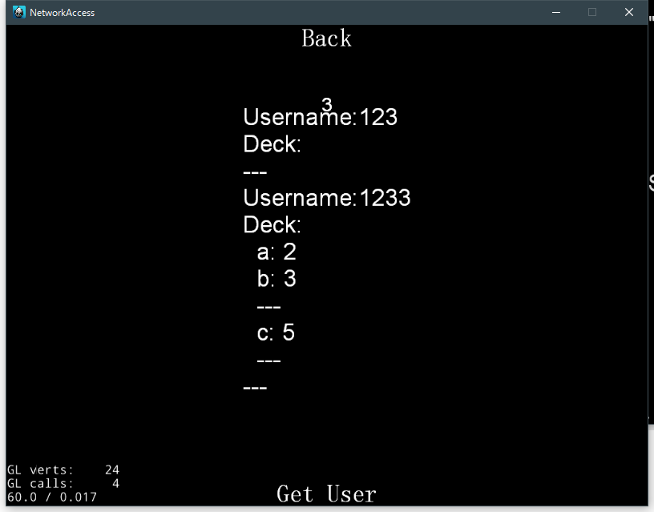

# Cocos2dx - 网络编程

这一次的作业使用Cocos2dx内置的`HttpClient` 网络库还有`rapidjson`JSON库


## 引入头文件

首先，我们需要引入对应的头文件

```cpp
#include "network/HttpClient.h"
#include "json/rapidjson.h"
#include "json/document.h"
#include "json/writer.h"
#include "json/stringbuffer.h"
using namespace cocos2d::network;
```


## 网络请求

下面使一个简单的`GET`请求的实现

```cpp
HttpRequest* request = new HttpRequest();
request->setRequestType(HttpRequest::Type::GET);
request->setUrl("http://127.0.0.1:8000/users");
request->setResponseCallback(CC_CALLBACK_2(LoginRegisterScene::onHttpRegisterComplete, this));
cocos2d::network::HttpClient::getInstance()->send(request);
request->release();
```

设置好一系列的类型、URL等参数之后，设置好回调函数，就可以将这个请求加入请求队列中。

然后是回调函数：

```cpp
void LoginRegisterScene::onHttpRegisterComplete(HttpClient *sender, HttpResponse *response);
```

回调函数会在这次请求收到返回值的时候被调用


## JSON的构建

对于大多数的请求，我们都需要提交一个`JSON`信息给服务器

这里我们使用`rapidjson` 来构建JSON字符串，将DOM形式的数据转换为字符串然后发送给服务器

```cpp
rapidjson::Document document;
document.SetObject();
rapidjson::Document::AllocatorType& allocator = document.GetAllocator();

rapidjson::Value username;
username.SetString(rapidjson::StringRef(usernameInput->getString().c_str()));
document.AddMember("username", username, allocator);

StringBuffer buffer;
rapidjson::Writer<StringBuffer> writer(buffer);
document.Accept(writer);
```

根据官方文档，对于**字符串的创建**

`RapidJSON` 提供两个 String 的存储策略。

1. `copy-string`: 分配缓冲区，然后把来源数据复制至它。
2. `const-string`: 简单地储存字符串的指针。

`copy-string `总是安全的，因为它拥有数据的克隆。`const-string `可用于存储字符串字面量。

由于这里的数据是从对话框中获取的

需要通过`StringRef`创建一个`copy-string`，然后使用`SetString`方法把这个数据传入一个`Value`里面，再通过`AddMember`添加到`Document`中

当然，`RapidJSON` 还支持很多形式的数据，具体可以查看[官方文档](http://rapidjson.org/zh-cn/md_doc_tutorial_8zh-cn.html#CreateModifyValues)

到这里，我们以及获得了一个具有完整数据的`DOM`形式的`JSON`数据结构，接下就就是要输出，这里使用流来输出。

`StringBuffer` 是一个简单的输出流。它分配一个内存缓冲区，供写入整个 JSON。

使用 `GetString()` 来获取该缓冲区，然后添加到网络请求中：

```cpp
request->setRequestData(buffer.GetString(), buffer.GetSize());
```


## JSON的解析

收到服务器的请求返回之后，就需要解析JSON信息了。

```cpp
std::vector<char> *buffer = response->getResponseData();
std::string str(buffer->begin(), buffer->end());
rapidjson::Document d;
d.Parse<0>(str.c_str());
```

解析成`Document`之后，还需要使用`HasParseError`判断是否成功解析，以及是否存在指定的对象，然后才进行下一步的操作。

```cpp
if (d.HasParseError()) {
    messageBox->setString("Can't parse JSON from server.");
    return;
}
if (d.IsObject() && d.HasMember("status")) {
    if (d["status"].GetBool() == true) {
        std::string text("Register Success.\n");
        text.append(d["msg"].GetString());
        messageBox->setString(text);
    }
    else {
        std::string text("Register Failed.\n");
        text.append(d["msg"].GetString());
        messageBox->setString(text);
    }
}
else {
    messageBox->setString("Can't parse JSON from server.");
}
```

解析JSON的大多数方法和`C#`中十分类似，这里就不详细说明了。


## 启用Cookies

```cpp
cocos2d::network::HttpClient::getInstance()->enableCookies(nullptr);
```

只需要一句话就可以启用Cookies了。

由于HTTP是无状态的，因此服务器需要一个手段去识别不同的用户，其中最常用的机制就是`Session`。

`Session` 是存储服务器上的，一般都是存在内存中，一些大型的服务端还会做持久化处理。这个session 存储着用户的一些状态和信息，比如说是否登陆，用户ID等信息。既然说他是存储在服务端的，那么就需要一个方法是匹配客户端和服务端的信息，一般都是使用`Cookies`来实现的（这里顺便提一下，为了避免XSS攻击，通常会把这个cookies设置为`httpOnly`，即不能被该网站的脚本查看和修改，只能被浏览器和服务器查看和修改，但是这只是一个协议，对于自己实现协议的客户端并没有约束）。

这个cookies的用途就在于跟踪会话，在cookies中存储一个唯一的随机字符串，然后在服务端也存储一个类似于哈希表的数据结构，根据这个随机字符串寻找对应会话的信息，就可以使得无状态的HTTP实现有状态的会话。对于一些需要用户权限或者数据的请求，可以从session中获取用户信息，可以有效阻止非法访问。


## 运行截图




## 参考

http://rapidjson.org/zh-cn/md_doc_tutorial_8zh-cn.html#CreateString


