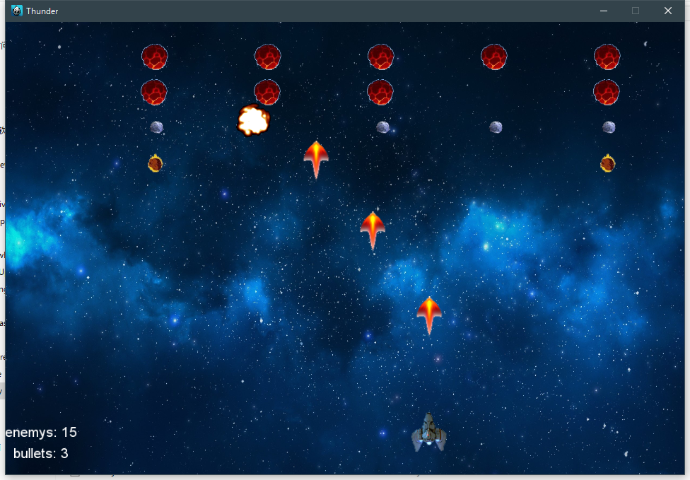
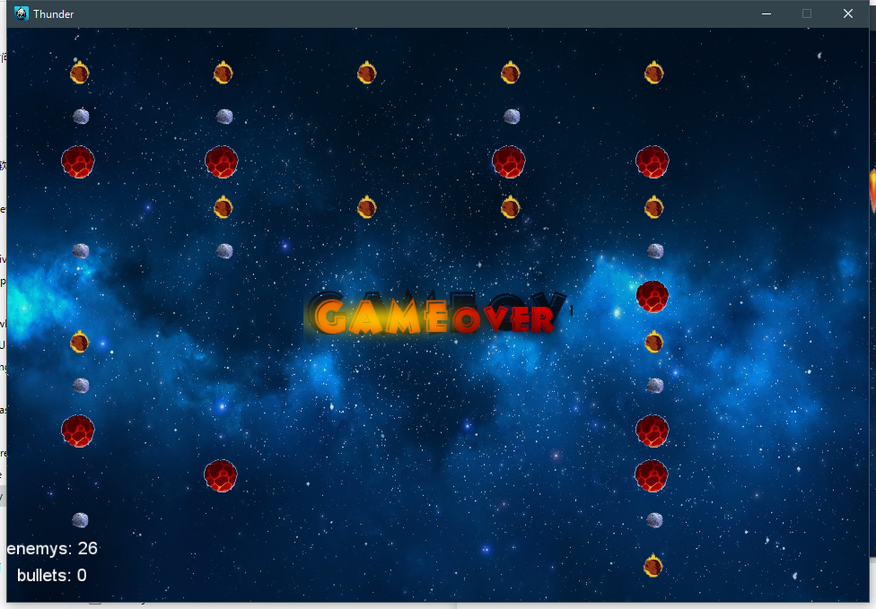

# Cocos2d-x | Thunder  - 飞机打石头游戏

这一周的作业是做一个飞机打石头的小游戏。

这里说一下一些关键的实现。

## 键盘控制飞机

这里主要是建立一个键盘监听器，当某个按钮被按下的时候，就将`移动`设置为`true`，同时记录下移动的方向，然后当按钮被释放的时候将`移动`设为`false`

```cpp
// 按下键盘
case EventKeyboard::KeyCode::KEY_LEFT_ARROW:
case EventKeyboard::KeyCode::KEY_CAPITAL_A:
case EventKeyboard::KeyCode::KEY_A:
    movekey = 'A';
    isMove = true;
    break;
```

然后在每一秒`update`的时候，检测这个变量，如果未`true`那就向指定的方向移动。

```cpp
// 飞船移动
if (isMove) this->movePlane(movekey);
```

这是一个比较常见的实现方法，需要注意的一点是，在释放按钮的时候，我们还需要判断释放的按钮是否为当前移动的方向，然后才将`移动`设置为`false`。否则的话，当你按下`A`之后又按下`D`，此时飞船是向右移动的，但是当你释放`A`的时候，飞船却不移动了，但是此时`D`还是处于按下状态，因此这样是非常不科学的。

```cpp
// 释放键盘
case EventKeyboard::KeyCode::KEY_LEFT_ARROW:
case EventKeyboard::KeyCode::KEY_A:
case EventKeyboard::KeyCode::KEY_CAPITAL_A:
    if (movekey == 'A') isMove = false;
    break;
```

```cpp
// 添加键盘事件监听器
void Thunder::addKeyboardListener() {
	auto keyboardListener = EventListenerKeyboard::create();
	keyboardListener->onKeyPressed = CC_CALLBACK_2(Thunder::onKeyPressed, this);
	keyboardListener->onKeyReleased = CC_CALLBACK_2(Thunder::onKeyReleased, this);
	this->getEventDispatcher()->addEventListenerWithSceneGraphPriority(keyboardListener, this);
}
```

## 键盘和触摸控制子弹发射

对于键盘控制那就十分简单了，只需要在键盘按下事件中调用发射子弹的函数就可以了，这里说一下触摸方面的实现。

通过创建一个`EventListenerTouchOneByOne::create()`这样的监听器可以实现对单点触摸的监听，当然多点触摸也是支持的，那就需要另外一个监听器了。

然后我们可以给`onTouchMoved`、`onTouchBegan`和`onTouchEnded` 这三个事件加上回调。

触摸发射子弹只需要在`onTouchBegan`的回调中调用子弹发生的函数即可。

```cpp
// 添加触摸事件监听器
void Thunder::addTouchListener() {
	auto touchListener = EventListenerTouchOneByOne::create();
	touchListener->onTouchMoved = CC_CALLBACK_2(Thunder::onTouchMoved, this);
	touchListener->onTouchEnded = CC_CALLBACK_2(Thunder::onTouchEnded, this);
	touchListener->onTouchBegan = CC_CALLBACK_2(Thunder::onTouchBegan, this);
	this->getEventDispatcher()->addEventListenerWithSceneGraphPriority(touchListener, this);
}
```


## 触摸拖动飞船移动

这个需求的实现和键盘控制移动其实是差不多的。

当点击的时候，在`onTouchBegan` 的回调里面判断触摸点是否在飞船的一定范围内，如果是，就将`触摸移动`设置为`true`

然后在`onTouchMoved`的回调里面判断`触摸移动`是否为`true`， 如果是的话，就把飞船的水平左边设置为当前触摸点的坐标

这样就实现了飞船的控制移动

```cpp
// 当鼠标按住飞船后可控制飞船移动
void Thunder::onTouchMoved(Touch *touch, Event *event) {
	if (isClick == true && gameOver == false) {
		if (touch->getLocation().x < 0 || touch->getLocation().x > visibleSize.width) return;
		player->setPosition(Vec2(touch->getLocation().x, player->getPosition().y));
	}
}
```


## 子弹发射

### 发射

这里主要是将子弹添加到容器中，并且触发移动动画，当子弹出了边界的时候，就需要移除子弹

```cpp
void Thunder::fire() {
	if (gameOver) return;
	auto bullet = Sprite::create("bullet.png");
	bullet->setAnchorPoint(Vec2(0.5, 0.5));
	bullets.push_back(bullet);
	bullet->setPosition(player->getPosition());
	addChild(bullet, 1);
	SimpleAudioEngine::getInstance()->playEffect("music/fire.wav");
	// 移除飞出屏幕外的子弹
	auto shotAnimate = MoveTo::create(1.0f, Vec2(bullet->getPosition().x, visibleSize.height));
	list<Sprite*> *pBullets = &bullets;
	auto action = Sequence::create(
		shotAnimate,
		CallFunc::create([pBullets, bullet] {
			pBullets->remove(bullet);
			bullet->removeFromParentAndCleanup(true);
		}),
		nullptr);
	bullet->runAction(action);
}
```


### 射中目标

在`update`里面调用一个自定义事件

检测子弹是否击中可以使用遍历石头列表和子弹列表来实现

当一个子弹距离一个石头过近的时候，就可以判断为子弹击中了那个石头

然后石头执行爆炸动画，然后将其从列表中移除，子弹也需要被移除。

而且在陨石与飞机距离过近的话也要触发游戏结束

```cpp
// 自定义碰撞事件
void Thunder::meet(EventCustom * event) {
	list<Sprite*>* pEnemys = &enemys;
	list<Sprite*>* pBullets = &bullets;
	for (auto enemy : enemys) {
		if (enemy->getPosition().getDistance(player->getPosition()) < 50) stopAc();
		for (auto bullet : bullets) {
			if (enemy->getPosition().getDistance(bullet->getPosition()) < 25) {
				SimpleAudioEngine::getInstance()->playEffect("music/explore.wav");
				enemy->runAction(
					Sequence::create(
						CallFunc::create([bullet, pBullets, enemy, pEnemys] {
							pEnemys->remove(enemy);
                              bullet->removeFromParentAndCleanup(true);
                              pBullets->remove(bullet);
						}),
						Animate::create(
							Animation::createWithSpriteFrames(explore, 0.05f, 1)
						),
						CallFunc::create([enemy, pEnemys] {
							enemy->removeFromParentAndCleanup(true);
						}),
						nullptr
					)
				);
			}
		}
	}
	// 判断子弹是否打中陨石并执行对应操作
}
```

如果碰撞在一起的话，我们可以通过回调事件将对象从容器中移除，并且触发爆炸效果。



## 音效

音效可以使用`Cocos2d-x` 内置的`SimpleAudioEngine`库来实现。

```cpp
// 预加载资源
SimpleAudioEngine::getInstance()->preloadBackgroundMusic("music/bgm.mp3");
SimpleAudioEngine::getInstance()->preloadEffect("music/explore.wav");
// 播放音效
SimpleAudioEngine::getInstance()->playEffect("music/explore.wav");
```

但是我在本地调试的时候会遇到一个问题，就是当音效播放的时候，整个UI线程都会卡住1秒左右，一开始我以为是资源没有预加载好，看了好久的文档。然后设置断点调试，以及查看他的源码，发现卡住的地方是在调用系统播放音乐的API的时候，就是下面这一句话：

```cpp
mciSendCommand(0,MCI_OPEN, MCI_OPEN_ELEMENT, reinterpret_cast<DWORD_PTR>(&mciOpen));
```

然后我就怀疑是系统或者驱动的问题，把游戏文件打包发给其他人，发现可以正常运行，但是本机每次播放音效或者背景音乐的时候就会卡上1秒。通过也发现系统调节音量的时候UI线程也会被卡住，所以我就没有管了。


## 移动范围

子弹和飞船都是有范围限制的，飞船的限制可以在移动的时候或者触摸事件里面实现

而子弹的范围就需要在其回调的时候实现。

```cpp
// 移除飞出屏幕外的子弹
auto shotAnimate = MoveTo::create(1.0f, Vec2(bullet->getPosition().x, visibleSize.height));
list<Sprite*> *pBullets = &bullets;
auto action = Sequence::create(
    shotAnimate,
    CallFunc::create([pBullets, bullet] {
        pBullets->remove(bullet);
        bullet->removeFromParentAndCleanup(true);
    }),
    nullptr);
bullet->runAction(action);
```


## 生成下一行的陨石

这里实现也不难，就是把当前所有的陨石下移一点，然后生成新的陨石。

重要的是安排好陨石生成的位置和移动的距离就可以了。

```cpp
// 陨石向下移动并生成新的一行
void Thunder::newEnemy() {
	for (auto enemy : enemys) {
		auto moveAnimate = MoveBy::create(0.1f, Vec2(0, -50));
		enemy->runAction(moveAnimate);
		if (enemy->getPosition().y < 100) stopAc();
	}
	char enemyPath[20];
	stoneType++;
	sprintf(enemyPath, "stone%d.png", stoneType);
	if (stoneType > 2) stoneType = 0;
	double width = visibleSize.width / 6.0f,
		height = visibleSize.height - 50;
	for (int j = 0; j < 5; j++) {
		auto enemy = Sprite::create(enemyPath);
		enemy->setAnchorPoint(Vec2(0.5, 0.5));
		enemy->setScale(0.5, 0.5);
		enemy->setPosition(width * j + 77, height);
		enemys.push_back(enemy);
		addChild(enemy, 1);
	}
}
```

当陨石移动到屏幕底边的时候，就判定为游戏结束了


